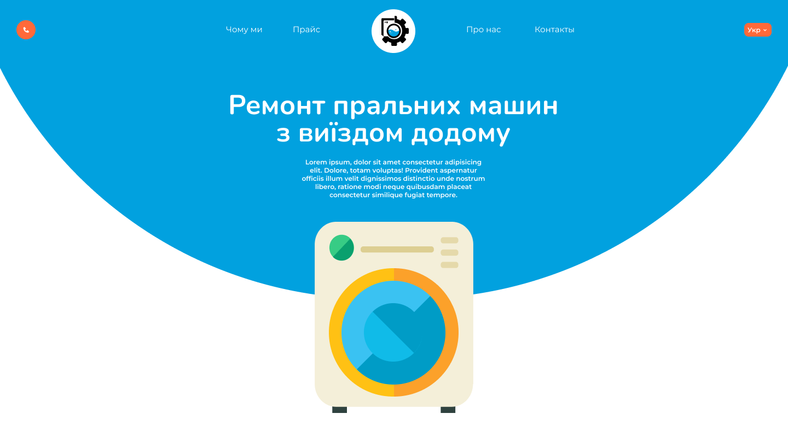

# DocService

## Links
<b>Figma: </b><a href="https://www.figma.com/file/5Xz43RP1jllLlCMuVjy36Y/Untitled?node-id=0%3A1&t=b2upHoZRzFGLVonu-3">DocService</a>
 
<b>Website: </b><a href="https://vercel.com/bohdan-134/docservice">DocService</a>

## Preprocessor's
- pug
- scss

## Libraries
- GSAP
- Swiper

## Task manager
- gulp

## Description
This project implements page translation using json. Sending the form to the telegram bot also works. Adaptation for mobile devices is not
